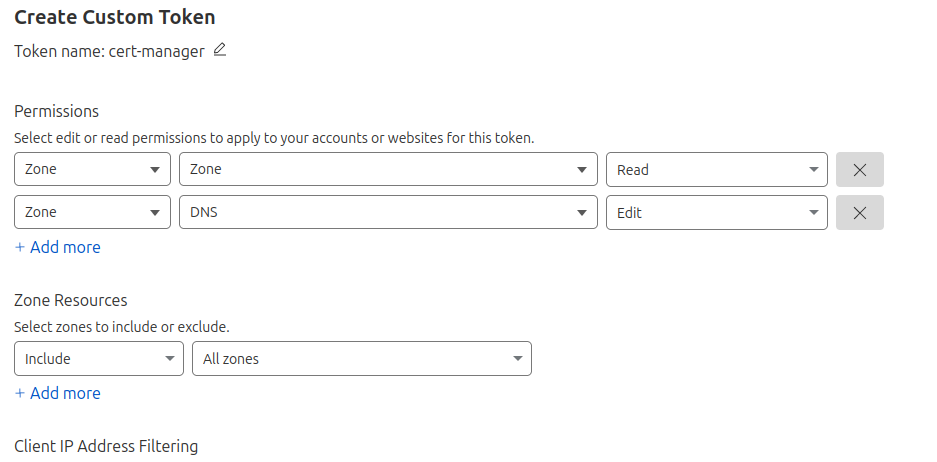
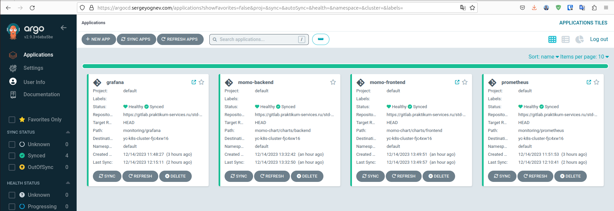

# momo-infrastructure

> [!NOTE]
> Application and supporting services are currently not deployed

## Main Services

- Aplication: [momo.sergeyognev.com](https://momo.sergeyognev.com)
- ArgoCD: [argocd.sergeyognev.com](https://argocd.sergeyognev.com)
- Grafana: [grafana.sergeyognev.com](https://grafana.sergeyognev.com)
- Prometheus: [prometheus.sergeyognev.com](https://prometheus.sergeyognev.com)

## Project structure

```
├── kubernetes
│   ├── argo
│   ├── backend
│   ├── certificate
│   └── frontend
├── momo-chart
│   └── charts
│       ├── backend
│       │   └── templates
│       └── frontend
│           └── templates
├── monitoring
│   ├── alertmanager
│   │   └── templates
│   ├── grafana
│   │   ├── dashboards
│   │   └── templates
│   └── prometheus
│       ├── rules
│       └── templates
├── terraform-k8s
└── terraform-s3
```

1. kubernetes
   1. argo - manifest for Argo ingress
   2. backend - manifests to deploy backend
   3. certificate - manifests for automatic issue and update of TLS certificate
   4. frontend - manifests to deploy frontend
2. momo-chart - Helm charts that are used by Argo to deloy the application
3. monitoring - Charts for monitoring services
4. terraform-k8s - IaC files for creating manages k8s in Yandex Cloud
5. terraform-s3 - IaC for creating S3-like object storage in Yandex Cloud

## Deploying

### Creating k8s cluster
1. Install [yc CLI](https://cloud.yandex.com/en/docs/cli/quickstart) and login
2. Get token:
```bash
yc config list
```
3. Add token to env variable
```bash
export YC_TOKEN=<your token>
```
4. Navigate to  `terraform-k8s`
5. Run following commands
```bash
terraform init
```

```bash
terraform plan
```

```bash
terraform apply
```

### Creating Object Storage

1. Navigate to `terraform-s3`
2. Run following commands

```bash
terraform init
```

```bash
terraform plan
```

```bash
terraform apply
```

### Cert-manager

For TLS certificate from Let's Encrypt, Cart-Manager and DNS01-challenge are used.
As a result, wildcard-certificate for all domens under `*.sergeyognev.com` will be received.
Cloudflare will be acting as DNS-provider.

1. Install cert-manager
```bash
kubectl apply -f https://github.com/cert-manager/cert-manager/releases/download/v1.13.3/cert-manager.yaml
```

2. Check that cert-manager is installed correctly
```bash
kubectl get pods --namespace cert-manager
```

3. Receive Cloudflare API token from Cloudflare, add it to `kubernetes/certificate/cloudflare-api-token.yaml`
and create a secret. Token should have following permissions:



```bash
kubectl apply -f cloudflare-api-token.yaml
```
`stringData` field is used in the secret, so token should be added as plain text
without `base64` encoding


4. Install cluster issuer

```bash
kubectl apply -f clusterissuer-prod.yaml
```

It is recommended to first install the staging cluster issuer to avoid exceeding
Let’s Encrypt limits. If the test is successful, replace staging with prod.

5. Check cluster issuer
```bash
kubectl get clusterissuer
```

```bash
kubectl describe clusterissuer <name>
```

6. Add wildcard certificate
```bash
kubectl apply -f wildcard-certificate.yaml
```

7. Check certificate

```bash
kubectl get certificate
```

8. To troubleshoot bugs, review the test log (if necessary).
```bash
kubect describe challenge
```

### Install ArgoCD

1. Install ArgoCD
2. 
```bash
kubectl create namespace argocd
```

```bash
kubectl apply -n argocd -f https://raw.githubusercontent.com/argoproj/argo-cd/stable/manifests/install.yaml
```

2. Create Ingress for ArgoCD

```bash
kubectl apply -f argo/argo-ingress.yaml
```

3. Copy the certificate from the default namespace to the argocd namespace (the simplest method that came to mind):
   1. Output the certificate to the console.
   2. Copy all the data into a new yaml file.
   3. Change the namespace in the file.
   4. Create a secret in the new namespace.


```bash
kubectl get secret sergeyognev-com-tls -oyaml
```

4. Create default password for ArgoCD
 
```bash
argocd admin initial-password -n argocd
```

5. Register via CLI
```bash
argocd login argocd.sergeyognev.com
```
6. Add your cluster
```bash
argocd cluster add <context name> --server argocd.sergeyognev.com
```

### Deploy app
1. Add your repo to ArgoCD
2. Install application, using Helm-chart
3. Following result is expected



### Install monitoring and logging systems

1. Navigate to  `monitoring` dorectory
2. Install ClusterRoleBinging for Prometheus (to see data from application)
```bash
kubectl apply -f access.yaml
```
3. Install Prometheus
```bash
helm upgrade --atomic --install prometheus prometheus 
```
4. Install Grafana
```bash
helm upgrade --atomic --install grafana grafana 
```
5. [Install](https://grafana.com/docs/loki/latest/setup/install/helm/install-monolithic/) Loki
```bash
helm install --values loki.yaml loki grafana/loki
```

6. [Install](https://grafana.com/docs/loki/latest/send-data/promtail/installation/) Promtail
```bash
helm upgrade --install promtail grafana/promtail
```
